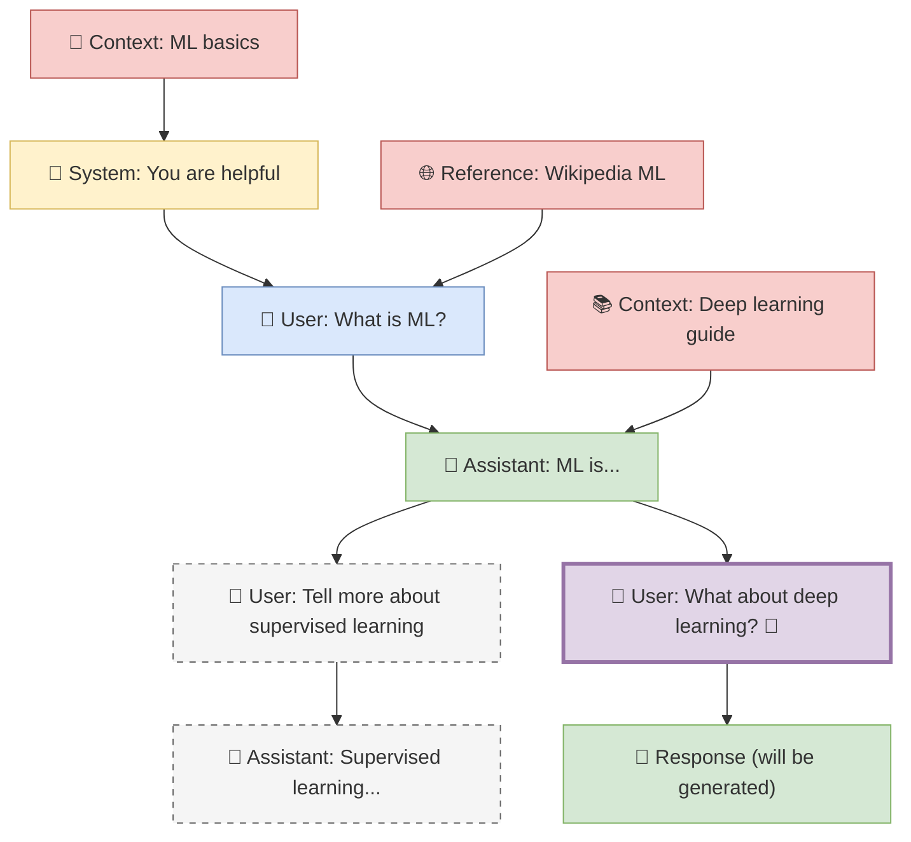

# Obsidian Canvas Context Plugin - Implementation Plan

## Project Overview

Transform Obsidian's canvas into a spatial context-aware LLM interface where canvas nodes become conversation elements and spatial relationships define context flow.

### Core Vision
- **Spatial Context Building**: Use canvas node positioning and connections to build rich LLM context
- **Local-First LLM Integration**: Start with Ollama/LMStudio for privacy and speed
- **Minimal UI Disruption**: Enhance existing canvas workflow rather than replacing it
- **Frontmatter-Driven Configuration**: Use markdown frontmatter for fine-grained control

## Canvas Tree Walking Algorithm

### Trigger Mechanism
- **Right-click** on any canvas node → "Send to LLM" context menu option

### Context Building Rules
1. **Walk UP the Tree**: Follow parent connections (nodes feeding into current node) - this is the main conversation thread
2. **Collect Horizontal Context**: For each node in the parent chain, include any connected nodes from left OR right (no distinction) - these are supplementary context materials and reference documents
3. **Exclude Sibling Branches**: Don't include parallel conversation branches that split off from the same parent nodes
4. **Main Thread Priority**: The vertical conversation flow is primary, horizontal connections provide additional context only

### Context Priority Order
1. **System Prompts** (role: system) - Always first in LLM context
2. **Parent Chain** (following connections upward) - Main conversation flow
3. **Horizontal Context** (left/right connections) - Supporting information
4. **Target Node** (the clicked node) - Final context element

### Branch Handling
- **Sibling branches** are parallel conversation paths that diverge from the same parent node
- Include the **parent chain** (your direct conversation thread) and all its **horizontal context**
- Exclude **sibling conversation nodes** (other branches from the same parents)
- This preserves relevant context while avoiding confusion from parallel conversations

### Visual Example



**Legend:**
- 🔧 System prompts
- 👤 User messages  
- 🤖 Assistant responses
- 📄📚🌐 Context materials
- 🎯 Target node (right-clicked)
- Dashed lines: Excluded sibling branches

**Context Collection for Right-Clicked Node**:
- **Main Thread**: System → User: What is ML? → Assistant: ML is... → User: What about deep learning?
- **Context Included**: ML basics + Wikipedia ML + Deep learning guide (all horizontal context from parent chain)
- **Excluded**: "Tell more about supervised learning" (sibling branch) and its responses

## Frontmatter Properties System

### Essential Properties Only
```yaml
# LLM API Role (maps directly to completion API)
role: system | user | assistant

# Optional Organization
tags: ["context", "research", "sibling-branch"]
```

### System Prompt Special Case
```yaml
role: system
model: "llama3.1"       # Optional, defaults to plugin setting
temperature: 0.7        # Optional, defaults to plugin setting
```

### Context Materials
Context materials (reference docs, supporting info) use:
```yaml
role: user              # Maps to LLM user role in API
tags: ["context"]       # Identifies as context material
```

### Design Principles
- **Minimal Properties**: Only use what maps to LLM APIs or provides essential organization
- **No Invented Roles**: Stick to standard `system`, `user`, `assistant` roles
- **Plugin-Level Configuration**: Model selection and parameters set in plugin UI, not per-node
- **Tags for Organization**: Use `tags` field for categorization without inventing properties

## Local LLM Integration Strategy

### Phase 1: Ollama Integration
```typescript
interface OllamaConfig {
  baseUrl: string;        // Default: http://localhost:11434
  model: string;          // e.g., "llama3.1", "codellama"
  timeout: number;        // Request timeout in ms
}

// API Endpoint
POST /api/generate
{
  "model": "llama3.1",
  "prompt": "context + user message",
  "stream": false,
  "options": {
    "temperature": 0.7,
    "max_tokens": 1000
  }
}
```

### Phase 2: LMStudio Support
```typescript
interface LMStudioConfig {
  baseUrl: string;        // Default: http://localhost:1234
  model: string;          // Model identifier
  apiKey?: string;        // Optional API key
}

// OpenAI-Compatible API
POST /v1/chat/completions
{
  "model": "model-name",
  "messages": [
    {"role": "system", "content": "..."},
    {"role": "user", "content": "..."}
  ],
  "temperature": 0.7,
  "max_tokens": 1000
}
```

### Model Management
- **Auto-detection**: Scan for available models on startup
- **Model Switching**: Per-node model selection via frontmatter
- **Fallback Strategy**: Default to fastest available model
- **Health Checks**: Verify LLM service availability

## Technical Implementation Phases

### Phase 1: Foundation (Week 1-2)
**Goal**: Basic canvas analysis and context extraction

1. **Canvas API Integration**
   - Read canvas files and parse JSON structure
   - Extract node content, positions, and connections
   - Identify node types (text, file, image, etc.)

2. **Tree Walking Implementation**
   - Implement parent chain traversal
   - Add spatial context collection (left/right/top)
   - Handle circular references and orphaned nodes

3. **Basic LLM Integration**
   - Ollama HTTP client implementation
   - Simple text generation workflow
   - Error handling and timeouts

### Phase 2: Context Management (Week 3-4)
**Goal**: Sophisticated context building with frontmatter

1. **Frontmatter Parsing**
   - Parse YAML frontmatter from text nodes
   - Validate properties against schema
   - Apply defaults for missing properties

2. **Context Algorithm**
   - Implement priority-based context ordering
   - Add context type filtering
   - Spatial weight calculations
   - Connection weight influence

3. **Response Integration**
   - Generate response nodes on canvas
   - Position responses using layout hints
   - Apply visual styling based on node role

### Phase 3: User Interface (Week 5-6)
**Goal**: Seamless user experience and configuration

1. **Context Menu Integration**
   - "Send to LLM" right-click option
   - "Configure Node" for frontmatter editing
   - "Regenerate Response" for assistant nodes

2. **Settings Panel**
   - LLM provider configuration (Ollama/LMStudio)
   - Default model and parameter settings
   - Context building preferences

3. **Visual Feedback**
   - Loading indicators during generation
   - Error state display
   - Context preview (show what will be sent)

### Phase 4: Advanced Features (Week 7-8)
**Goal**: Power user features and workflow optimization

1. **Batch Operations**
   - Send multiple nodes to LLM simultaneously
   - Bulk property editing
   - Template application

2. **Context Templates**
   - Predefined system prompts
   - Workflow templates (research, writing, coding)
   - Shareable template system

3. **Advanced Routing**
   - Model selection based on content type
   - Automatic fallbacks and retries
   - Response quality scoring

## MVP Feature Set

### Core Features (Must Have)
- ✅ Canvas tree walking rules defined (simplified branching logic)
- ✅ Frontmatter properties simplified (role, tags only)
- ✅ Example canvas structure created for testing
- ✅ Canvas node content extraction (file nodes with Obsidian's built-in methods)
- ✅ Tree walking algorithm implementation (parent chain + horizontal context)
- ⏳ Ollama integration with text generation
- ⏳ Right-click "Send to LLM" functionality
- ⏳ Response node creation and positioning
- ⏳ Basic error handling and user feedback

### Enhanced Features (Should Have)
- ⏳ LMStudio integration
- ❌ Context priority and filtering (removed - over-engineering)
- ⏳ Settings panel for configuration
- ❌ Visual node styling by role (using Obsidian canvas colors)
- ❌ Frontmatter editing interface (use Obsidian's native editing)
- ⏳ Context preview before sending

### Advanced Features (Could Have)
- ⏳ Batch processing multiple nodes
- ⏳ Template system for common workflows
- ⏳ Response regeneration with different parameters
- ⏳ Context debugging and visualization
- ⏳ Export conversation chains
- ⏳ Integration with other LLM providers

## File Structure

```
src/
├── main.ts                 # Plugin entry point
├── canvas/
│   ├── parser.ts           # Canvas file parsing
│   ├── walker.ts           # Tree walking algorithm
│   └── context.ts          # Context building logic
├── llm/
│   ├── client.ts           # LLM HTTP client
│   ├── ollama.ts           # Ollama-specific implementation
│   ├── lmstudio.ts         # LMStudio integration
│   └── response.ts         # Response processing
├── frontmatter/
│   ├── parser.ts           # YAML frontmatter parsing
│   ├── schema.ts           # Property validation schema
│   └── editor.ts           # Frontmatter editing UI
├── ui/
│   ├── context-menu.ts     # Right-click menu
│   ├── settings.ts         # Settings panel
│   └── modal.ts            # Modal dialogs
└── types/
    ├── canvas.ts           # Canvas-related types
    ├── llm.ts              # LLM API types
    └── settings.ts         # Plugin settings types
```

## Example Workflow

1. **User Creates Canvas Structure**:
   ```
   [Research Notes] ← [Data Source] → [Analysis Method]
            ↓
   [Question: "What trends do you see?"]
            ↓
   [Response] (to be generated)
   ```

2. **User Right-Clicks on Question Node**:
   - Plugin extracts parent chain: Research Notes
   - Includes spatial context: Data Source, Analysis Method
   - Builds LLM message array with proper roles

3. **Context Sent to LLM**:
   ```
   Messages: [
     {role: "system", content: "Research Notes content"},
     {role: "user", content: "Data Source + Analysis Method + Question"}
   ]
   ```

4. **Response Integrated**:
   - New node created below question
   - Content populated with LLM response
   - Frontmatter added: `role: assistant`, `source_model: llama3.1`

## Success Metrics

### Technical Performance
- Canvas parsing: < 100ms for 100+ nodes
- Context building: < 50ms for complex graphs
- LLM response time: < 30s for typical queries
- Memory usage: < 50MB additional overhead

### User Experience
- Setup time: < 5 minutes from install to first use
- Learning curve: Intuitive for existing canvas users
- Error recovery: Graceful handling of LLM failures
- Workflow integration: Seamless with existing Obsidian usage

### Feature Completeness
- MVP features: 100% implemented and tested
- Enhanced features: 80% implemented
- Advanced features: 40% prototyped
- Documentation: Complete for all user-facing features

## Risk Mitigation

### Technical Risks
- **Canvas API Changes**: Monitor Obsidian updates, maintain compatibility layer
- **LLM Service Availability**: Implement retries, fallbacks, offline mode
- **Performance Issues**: Optimize algorithms, add caching, lazy loading

### User Experience Risks
- **Complex Configuration**: Provide sensible defaults, guided setup
- **Steep Learning Curve**: Create tutorials, example workflows
- **Feature Creep**: Maintain focus on core spatial context value

### Integration Risks
- **Plugin Conflicts**: Test with popular plugins, namespace properly
- **Data Loss**: Implement backup/recovery, atomic operations
- **Privacy Concerns**: Local-first approach, clear data handling docs

## Current Progress (Updated)

### ✅ Completed This Session
1. **Canvas Tree Walking Rules**: Defined simplified branching logic
   - Walk UP the parent chain (main conversation thread)
   - Include horizontal context from all nodes in parent chain
   - Exclude sibling conversation branches (not context materials)
   - No left/right distinction needed

2. **Frontmatter Properties Simplified**: Removed over-engineering
   - `role: system | user | assistant` (maps to LLM APIs)
   - `tags: ["context"]` for organization only
   - Model/temperature selection in plugin UI, not per-node

3. **Test Structure Created**: Complete example canvas ready for testing
   - 9 markdown files with realistic ML conversation content
   - Canvas structure matches mermaid diagram from plan
   - Clear branching scenario to validate tree walking algorithm

4. **Vitest Testing Setup**: Complete test infrastructure configured
   - Vitest with jsdom environment for DOM testing
   - Mock Obsidian API setup in test configuration
   - Test scripts: `pnpm test`, `pnpm test:watch`, `pnpm test:ui`, `pnpm test:coverage`
   - Placeholder test files for all major modules (canvas walker, frontmatter parser, Ollama client)
   - TypeScript configuration with path aliases for clean imports

5. **Canvas Walker Implementation**: Complete tree walking algorithm
   - Parent chain traversal with cycle detection
   - Horizontal context collection for all nodes in parent chain
   - File node content extraction using Obsidian's `getFrontMatterInfo()` and metadata cache
   - Text nodes excluded (would require manual frontmatter maintenance)
   - System messages properly ordered first in output array
   - Role validation with fallback to "user" for invalid roles
   - Horizontal context wrapped in `<additional-document>` tags for LLM clarity

6. **Canvas Walker Testing**: Complete test suite with bug fixes
   - Fixed parent chain walking bug (no longer includes child nodes)
   - Test coverage for all walker scenarios: linear chains, horizontal context, branching
   - Proper CanvasViewDataEdge type definitions with fromNode, toNode, fromSide, toSide
   - Mock setup for Obsidian API components (TFile, metadata cache, vault operations)
   - All tests passing with correct behavior validation

### 🎯 Ready for Next Session
1. **Canvas Parser Implementation**: Read .canvas JSON files and parse structure
2. **Basic Obsidian Plugin Structure**: Context menu integration, settings panel
3. **Ollama Integration**: HTTP client for local LLM calls
4. **Response Node Creation**: Generate and position LLM responses on canvas

### 📋 Technical Decisions Made
- **Text Nodes**: Excluded from processing to avoid manual frontmatter maintenance burden
- **Frontmatter Extraction**: Uses Obsidian's built-in `getFrontMatterInfo()` and metadata cache
- **Message Ordering**: System prompts first, then conversation messages (proper LLM API format)
- **Context Wrapping**: Horizontal context wrapped in `<additional-document>` tags for clarity
- **Role Validation**: Only allows "system", "user", "assistant" with fallback to "user"
- **Edge Structure**: Canvas edges require fromNode, toNode (node IDs), fromSide, toSide (attachment points)
- **Parent Chain Algorithm**: Fixed to only walk UP (exclude children), properly distinguish horizontal context
- **Test Coverage**: Comprehensive testing ensures walker behavior matches design specifications

This simplified approach focuses on core value: spatial context building with LLMs, without unnecessary complexity.