# Obsidian Canvas Context Plugin - Implementation Plan

## Project Overview

Transform Obsidian's canvas into a spatial context-aware LLM interface where canvas nodes become conversation elements and spatial relationships define context flow.

### Core Vision

- **Spatial Context Building**: Use canvas node positioning and connections to build rich LLM context
- **Local-First LLM Integration**: Start with Ollama/LMStudio for privacy and speed
- **Minimal UI Disruption**: Enhance existing canvas workflow rather than replacing it
- **Frontmatter-Driven Configuration**: Use markdown frontmatter for fine-grained control

## Canvas Tree Walking Algorithm

### Trigger Mechanism

- **Right-click** on any canvas node → "Send to LLM" context menu option

### Context Building Rules

1. **Walk UP the Tree**: Follow parent connections (nodes feeding into current node) - this is the main conversation thread
2. **Collect Horizontal Context**: For each node in the parent chain, include any connected nodes from left OR right (no distinction) - these are supplementary context materials and reference documents
3. **Exclude Sibling Branches**: Don't include parallel conversation branches that split off from the same parent nodes
4. **Main Thread Priority**: The vertical conversation flow is primary, horizontal connections provide additional context only

### Context Priority Order

1. **System Prompts** (role: system) - Always first in LLM context
2. **Parent Chain** (following connections upward) - Main conversation flow
3. **Horizontal Context** (left/right connections) - Supporting information
4. **Target Node** (the clicked node) - Final context element

### Branch Handling

- **Sibling branches** are parallel conversation paths that diverge from the same parent node
- Include the **parent chain** (your direct conversation thread) and all its **horizontal context**
- Exclude **sibling conversation nodes** (other branches from the same parents)
- This preserves relevant context while avoiding confusion from parallel conversations

### Visual Example

```mermaid
graph TD
    A["🔧 System: You are helpful"] --> B["👤 User: What is ML?"]
    C["📄 Context: ML basics"] --> A
    D["🌐 Reference: Wikipedia ML"] --> B

    B --> E["🤖 Assistant: ML is..."]
    F["📚 Context: Deep learning guide"] --> E

    E --> G["👤 User: Tell more about supervised learning"]
    E --> H["👤 User: What about deep learning? 🎯"]

    G --> I["🤖 Assistant: Supervised learning..."]
    H --> J["🤖 Response (will be generated)"]

    classDef system fill:#fff2cc,stroke:#d6b656
    classDef user fill:#dae8fc,stroke:#6c8ebf
    classDef assistant fill:#d5e8d4,stroke:#82b366
    classDef context fill:#f8cecc,stroke:#b85450
    classDef target fill:#e1d5e7,stroke:#9673a6,stroke-width:3px
    classDef excluded fill:#f5f5f5,stroke:#666666,stroke-dasharray: 5 5

    class A system
    class B,H user
    class E,I,J assistant
    class C,D,F context
    class H target
    class G,I excluded
```



**Legend:**

- 🔧 System prompts
- 👤 User messages
- 🤖 Assistant responses
- 📄📚🌐 Context materials
- 🎯 Target node (right-clicked)
- Dashed lines: Excluded sibling branches

**Context Collection for Right-Clicked Node**:

- **Main Thread**: System → User: What is ML? → Assistant: ML is... → User: What about deep learning?
- **Context Included**: ML basics + Wikipedia ML + Deep learning guide (all horizontal context from parent chain)
- **Excluded**: "Tell more about supervised learning" (sibling branch) and its responses

## Frontmatter Properties System

### Essential Properties Only

```yaml
# LLM API Role (maps directly to completion API)
role: system | user | assistant

# Optional Organization
tags: ["context", "research", "sibling-branch"]
```

### System Prompt Special Case

```yaml
role: system
model: "llama3.1" # Optional, defaults to plugin setting not yet implemented
temperature: 0.7 # Optional, defaults to plugin setting not yet implemented
```

### Context Materials

Context materials (reference docs, supporting info) use:

```yaml
role: user # Maps to LLM user role in API
tags: ["context"] # Identifies as context material
```

### Design Principles

- **Minimal Properties**: Only use what maps to LLM APIs or provides essential organization
- **No Invented Roles**: Stick to standard `system`, `user`, `assistant` roles
- **Plugin-Level Configuration**: Model selection and parameters set in plugin UI, not per-node
- **Tags for Organization**: Use `tags` field for categorization without inventing properties

## Local LLM Integration Strategy

Use Vercels AI SDK for flexible LLM provider support. No need for hitting the APIs bare bones.

### Provider Architecture with Vercel AI SDK

The plugin uses **Vercel's AI SDK** for unified LLM provider support, making it straightforward to add new providers with consistent interfaces.

#### Current Provider Support

The plugin supports four LLM providers through the Vercel AI SDK:

1. **Ollama Integration** (`ollama-ai-provider-v2`)
   - Local inference server, default: http://localhost:11434
   - No API key required

2. **LM Studio Support** (`@ai-sdk/openai-compatible`)
   - Local inference server, default: http://localhost:1234
   - No API key required

3. **OpenAI Integration** (`@ai-sdk/openai`)
   - Cloud service requiring API key authentication
   - Default endpoint: https://api.openai.com

4. **OpenRouter Integration** (`@openrouter/ai-sdk-provider`)
   - Universal API gateway requiring API key authentication
   - Default endpoint: https://openrouter.ai/api/v1

#### Provider Interface Pattern

All providers in `src/llm/providers/` implement a consistent interface with:

- `providerName` constant for identification
- `createProvider()` function for SDK initialization
- `isProviderAlive()` health check function
- `listModels()` model enumeration function

#### Adding New Providers

To add a new LLM provider:

1. **Install AI SDK package** for the provider
2. **Create provider file** in `src/llm/providers/`
3. **Implement interface** following existing provider patterns
4. **Register provider** in `src/llm/providers/providers.ts` registry
5. **Update types** in `src/types/llm-types.ts`
6. **Update UI** by adding option to provider dropdown

### Model Management

- **Unified Interface**: All providers use Vercel AI SDK's consistent API
- **Model Discovery**: Dynamic model listing with alphabetical sorting
- **Authentication Handling**: Flexible API key support where required
- **Health Checks**: Provider availability verification before use
- **Configuration Storage**: Secure API key storage in plugin settings

## Technical Implementation Phases

### Phase 1: Foundation (Week 1-2)

**Goal**: Basic canvas analysis and context extraction

1. **Canvas API Integration**
   - Read canvas files and parse JSON structure
   - Extract node content, positions, and connections
   - Identify node types (text, file, image, etc.)

2. **Tree Walking Implementation**
   - Implement parent chain traversal
   - Add spatial context collection (left/right/top)
   - Handle circular references and orphaned nodes

3. **Basic LLM Integration**
   - Ollama HTTP client implementation
   - Simple text generation workflow
   - Error handling and timeouts

### Phase 2: Context Management (Week 3-4)

**Goal**: Sophisticated context building with frontmatter

1. **Frontmatter Parsing**
   - Parse YAML frontmatter from text nodes
   - Validate properties against schema
   - Apply defaults for missing properties

2. **Context Algorithm**
   - Implement priority-based context ordering
   - Add context type filtering
   - Spatial weight calculations
   - Connection weight influence

3. **Response Integration**
   - Generate response nodes on canvas
   - Position responses using layout hints
   - Apply visual styling based on node role

### Phase 3: User Interface (Week 5-6)

**Goal**: Seamless user experience and configuration

1. **Context Menu Integration**
   - "Send to LLM" right-click option
   - "Configure Node" for frontmatter editing
   - "Regenerate Response" for assistant nodes

2. **Settings Panel**
   - LLM provider configuration (Ollama/LMStudio)
   - Default model and parameter settings
   - Context building preferences

3. **Visual Feedback**
   - Loading indicators during generation
   - Error state display
   - Context preview (show what will be sent)

### Phase 4: Advanced Features (Week 7-8)

**Goal**: Power user features and workflow optimization

1. **Batch Operations**
   - Send multiple nodes to LLM simultaneously
   - Bulk property editing
   - Template application

2. **Context Templates**
   - Predefined system prompts
   - Workflow templates (research, writing, coding)
   - Shareable template system

3. **Advanced Routing**
   - Model selection based on content type
   - Automatic fallbacks and retries
   - Response quality scoring

## MVP Feature Set

### Core Features (Must Have)

- ✅ Canvas tree walking rules defined (simplified branching logic)
- ✅ Frontmatter properties simplified (role, tags only)
- ✅ Example canvas structure created for testing
- ✅ Canvas node content extraction (file nodes with Obsidian's built-in methods)
- ✅ Tree walking algorithm implementation (parent chain + horizontal context)
- ✅ Multi-provider LLM integration (Ollama, LM Studio, OpenAI, OpenRouter) with Vercel AI SDK
- ✅ Right-click "Send to LLM" functionality
- ✅ Canvas selection toolbar integration with waypoints icon
- ✅ Response node creation and positioning
- ✅ API key authentication and secure storage for cloud providers
- ✅ Basic error handling and user feedback

### Enhanced Features (Should Have)

- ✅ Multi-provider support (Ollama, LM Studio, OpenAI, OpenRouter)
- ✅ Settings panel with model configuration UI
- ✅ API key authentication for cloud providers
- ✅ Model listing and validation for all providers
- 🔗 Visual node styling by role → [Issue #48](https://github.com/ff6347/obsidian-canvas-context/issues/48)
- ❌ Frontmatter editing interface (use Obsidian's native editing)
- 🔗 Context preview before sending → [Issue #44](https://github.com/ff6347/obsidian-canvas-context/issues/44)

### Advanced Features (Could Have)

- 🔗 Enhanced UI components → [Issue #43](https://github.com/ff6347/obsidian-canvas-context/issues/43)
- 🔗 Additional provider support → [Issue #42](https://github.com/ff6347/obsidian-canvas-context/issues/42)
- 🔗 Context debugging and visualization → [Issue #45](https://github.com/ff6347/obsidian-canvas-context/issues/45)
- 🔗 Performance optimization → [Issue #46](https://github.com/ff6347/obsidian-canvas-context/issues/46)
- 🔗 Advanced workflow features → [Issue #49](https://github.com/ff6347/obsidian-canvas-context/issues/49)

## File Structure

Current codebase structure with service-based architecture:

```
src/
├── main.ts                    # Plugin entry point (399 lines, refactored)
├── canvas/
│   ├── walker.ts              # Tree walking algorithm
│   └── nodes-actions.ts       # Canvas node actions and context menu
├── lib/
│   ├── constants.ts           # Plugin constants
│   └── settings-utils.ts      # Settings utility functions
├── llm/
│   ├── llm.ts                 # Main LLM inference logic
│   └── providers/             # Provider implementations
│       ├── providers.ts       # Provider registry
│       ├── ollama.ts          # Ollama provider
│       ├── lmstudio.ts        # LM Studio provider
│       ├── openai.ts          # OpenAI provider
│       └── openrouter.ts      # OpenRouter provider
├── services/                  # Service layer architecture (NEW)
│   ├── inference-service.ts   # LLM operations and error handling (118 lines)
│   ├── canvas-service.ts      # Canvas operations and node management (232 lines)
│   ├── menu-service.ts        # Menu building and observer management (147 lines)
│   └── status-service.ts      # Status bar management (18 lines)
├── types/
│   ├── canvas-types.ts        # Canvas-related types + service type exports
│   └── llm-types.ts          # LLM and provider types
└── ui/
    ├── settings.ts            # Settings panel
    ├── add-model-modal.ts     # Model configuration modal
    ├── api-key-modal.ts       # API key management modal
    ├── layout.tsx             # React layout component
    ├── view.tsx               # Main plugin view
    └── components/
        └── react-view.tsx     # React component wrapper
```

## Service Architecture

### Design Pattern: Service-Based Delegation

The codebase follows a service-based architecture where the main plugin class (`CanvasContextPlugin`) delegates specific responsibilities to focused service classes. This pattern reduces complexity and improves maintainability.

#### Core Services

1. **InferenceService** (`src/services/inference-service.ts`)
   - **Responsibility**: LLM operations and error management
   - **Key Features**:
     - Executes inference with model configuration
     - Tracks recent errors with timestamps
     - Provides provider-specific troubleshooting guidance
     - Manages loading status coordination
   - **Dependencies**: App instance, settings accessor, UI callbacks

2. **CanvasService** (`src/services/canvas-service.ts`)
   - **Responsibility**: Canvas operations and node management
   - **Key Features**:
     - Canvas discovery and file operations
     - Inference context capturing and preservation
     - Response node creation with proper positioning
     - Canvas file opening and persistence
   - **Dependencies**: App instance for workspace access

3. **MenuService** (`src/services/menu-service.ts`)
   - **Responsibility**: Canvas menu management and UI integration
   - **Key Features**:
     - Selection menu building for canvas toolbar
     - Mutation observer setup for menu changes
     - Canvas button injection for inference triggers
     - Proper cleanup of DOM observers
   - **Dependencies**: Inference callback function

4. **StatusService** (`src/services/status-service.ts`)
   - **Responsibility**: Status bar management
   - **Key Features**:
     - Loading status display with custom text
     - Status bar element manipulation
     - Simple show/hide operations
   - **Dependencies**: Status bar element reference

#### Architecture Benefits

- **Separation of Concerns**: Each service handles one specific domain
- **Reduced Complexity**: Main plugin class reduced from 936 to 399 lines (57% reduction)
- **Improved Testability**: Services can be tested independently
- **Better Maintainability**: Changes isolated to specific service boundaries
- **Minimal Coupling**: Services use dependency injection rather than tight coupling

#### Service Initialization Pattern

```typescript
export default class CanvasContextPlugin extends Plugin {
    private inferenceService!: InferenceService;
    private canvasService!: CanvasService;
    private menuService!: MenuService;
    private statusService!: StatusService;

    override async onload() {
        // Initialize services with dependency injection
        this.canvasService = new CanvasService(this.app);
        this.statusService = new StatusService(this.addStatusBarItem());
        this.inferenceService = new InferenceService(
            this.app,
            () => this.settings,
            (text) => this.statusService.showLoadingStatus(text),
            () => this.statusService.hideLoadingStatus(),
        );
        this.menuService = new MenuService(
            (nodeId, canvas) => this.runInference(nodeId, canvas),
        );
    }
}
```

#### Service Communication

- **Event-Driven**: Services communicate through callbacks and events
- **Unidirectional Flow**: Main plugin coordinates, services execute
- **Shared State**: Settings and configuration passed through accessors
- **Clean Interfaces**: Services expose minimal public APIs

## Example Workflow

1. **User Creates Canvas Structure**:
   - Canvas nodes with text content or linked files
   - Spatial connections define conversation flow
   - Frontmatter in nodes defines roles (system, user, assistant)

2. **User Clicks Canvas Context Button**:
   - Plugin walks UP the parent chain (conversation thread)
   - Collects horizontal context from connected nodes
   - Excludes sibling conversation branches

3. **Context Sent to LLM**:
   - System messages ordered first
   - Parent chain forms main conversation
   - Horizontal context wrapped in additional-document tags

4. **Response Integrated**:
   - New assistant node created below source
   - Positioned with proper canvas connections
   - Includes frontmatter with role and timestamp

## Success Metrics

### Technical Performance

- Canvas parsing: < 100ms for 100+ nodes
- Context building: < 50ms for complex graphs
- LLM response time: < 30s for typical queries
- Memory usage: < 50MB additional overhead

### User Experience

- Setup time: < 5 minutes from install to first use
- Learning curve: Intuitive for existing canvas users
- Error recovery: Graceful handling of LLM failures
- Workflow integration: Seamless with existing Obsidian usage

### Feature Completeness

- MVP features: 100% implemented and tested
- Enhanced features: 80% implemented
- Advanced features: 40% prototyped
- Documentation: Complete for all user-facing features

## Risk Mitigation

### Technical Risks

- **Canvas API Changes**: Monitor Obsidian updates, maintain compatibility layer
- **LLM Service Availability**: Implement retries, fallbacks, offline mode
- **Performance Issues**: Optimize algorithms, add caching, lazy loading

### User Experience Risks

- **Complex Configuration**: Provide sensible defaults, guided setup
- **Steep Learning Curve**: Create tutorials, example workflows
- **Feature Creep**: Maintain focus on core spatial context value

### Integration Risks

- **Plugin Conflicts**: Test with popular plugins, namespace properly
- **Data Loss**: Implement backup/recovery, atomic operations
- **Privacy Concerns**: Local-first approach, clear data handling docs

## Build & Development

- `pnpm dev` - Development build with watch mode (using Rolldown)
- `pnpm build` - Production build (using Rolldown)
- `pnpm typecheck` - TypeScript compilation check: `npx tsc --noEmit`
- `pnpm test` - Run unit tests with Vitest
- `pnpm format` - Run prettier on all source files
- `pnpm lint` - Run ESLint on all source files

### Build System

- **Migrated from esbuild to Rolldown** (January 2025)
- Native TypeScript support without Babel transpilation
- Uses `builtin-modules` package for Node.js externals
- TypeScript config enables `allowImportingTsExtensions` for .ts/.tsx imports

### Release System

- **Semantic Release Integration**: Automated versioning and publishing using semantic-release
- **Version Synchronization**: `@semantic-release/exec` plugin runs `node version-bump.js` during prepare step
- **Obsidian Plugin Assets**: Automated manifest.json and versions.json updates for Obsidian compatibility
- **GitHub Release**: Automated asset uploads (main.js, manifest.json, styles.css, versions.json)
- **CI/CD Pipeline**: Full automation from commit to plugin release

## Code Style

- Uses TypeScript with strict settings
- Prettier configured with tabs, semicolons, double quotes
- Target: Obsidian plugin development

## Current Progress (Updated)

### ✅ Completed (Sep 5-7, 2025 - Jan 9, 2025)

1. **Canvas Tree Walking Rules**: Defined simplified branching logic

- Walk UP the parent chain (main conversation thread)
- Include horizontal context from all nodes in parent chain
- Exclude sibling conversation branches (not context materials)
- No left/right distinction needed

2. **Frontmatter Properties Simplified**: Removed over-engineering

- `role: system | user | assistant` (maps to LLM APIs)
- `tags: ["context"]` for organization only
- Model/temperature selection in plugin UI, not per-node

3. **Test Structure Created**: Complete example canvas ready for testing

- 9 markdown files with realistic ML conversation content
- Canvas structure matches mermaid diagram from plan
- Clear branching scenario to validate tree walking algorithm

4. **Vitest Testing Setup**: Complete test infrastructure configured

- Vitest with jsdom environment for DOM testing
- Mock Obsidian API setup in test configuration
- Test scripts: `pnpm test`, `pnpm test:watch`, `pnpm test:ui`, `pnpm test:coverage`
- Placeholder test files for all major modules (canvas walker, frontmatter parser, Ollama client)
- TypeScript configuration with path aliases for clean imports

5. **Canvas Walker Implementation**: Complete tree walking algorithm

- Parent chain traversal with cycle detection
- Horizontal context collection for all nodes in parent chain
- File node content extraction using Obsidian's `getFrontMatterInfo()` and metadata cache
- Text nodes excluded (would require manual frontmatter maintenance)
- System messages properly ordered first in output array
- Role validation with fallback to "user" for invalid roles
- Horizontal context wrapped in `<additional-document>` tags for LLM clarity

6. **Canvas Walker Testing**: Complete test suite with all fixes implemented

- Fixed parent chain walking bug (no longer includes child nodes)
- Test coverage for all walker scenarios: linear chains, horizontal context, branching
- Proper CanvasViewDataEdge type definitions with fromNode, toNode, fromSide, toSide
- Mock setup for Obsidian API components (TFile, metadata cache, vault operations)
- Fixed TFile mock constructor issue (path parameter missing)
- Fixed import issue (using mock TFile instead of real Obsidian TFile in tests)
- All 14 tests passing with correct behavior validation

7. **Canvas Text Card Support Implementation**: Full integration with canvas workflow

- **Gray-matter Integration**: Added frontmatter parsing for canvas text nodes
- **Text Node Processing**: Canvas text cards now supported alongside file nodes
- **Default Role Assignment**: Cards without frontmatter default to `role: "user"`
- **LLM Response Node Creation**: Automatic creation of assistant response nodes on canvas
- **Canvas API Integration**: Uses proper Obsidian Canvas API (getData, importData, requestFrame)
- **Visual Positioning**: Response nodes positioned below source with bottom-to-top connections
- **Color Coding**: Assistant response nodes use color "3" for visual distinction
- **Status Bar Loading**: Shows "Running inference..." with spinner during LLM calls
- **Frontmatter Format**: Assistant responses include proper YAML frontmatter with empty lines

8. **Enhanced User Experience**: Streamlined canvas-native workflow

- **Drag-and-Drop Support**: Users can create text cards by dragging from connectors
- **Mixed Node Types**: Supports both file nodes and text cards in same canvas
- **Automatic Edge Creation**: Connects response nodes to source nodes
- **Enhanced Loading Indicators**: Status bar with animated spinner, pulsing background, and fade-pulse text effects

9. **Loading UX Implementation**: Comprehensive visual feedback system

- **Status Bar Integration**: Non-blocking loading indicator in familiar location
- **Multiple Animation Layers**: Background pulse (2s), text fade-pulse (1.5s), spinner rotation (0.8s)
- **Enhanced Visibility**: Larger spinner (14px), bold text (font-weight 500), accent color highlights
- **User-Centered Design**: Rejected modal and floating approaches for subtle status bar enhancement

10. **React UI with Base UI Components**: Modern settings interface foundation

- **Layout Component Fixed**: Resolved object rendering errors with proper React.FC typing
- **Base UI Integration**: Successfully integrated Switch components with state management
- **Component Architecture**: Established proper TypeScript interfaces and event handlers
- **Working Foundation**: Ready for advanced UI components (Select, Input, Dialog, etc.)

11. **Release Workflow Enhancement**: Fully automated Obsidian plugin deployment

- **Semantic-Release GitHub Plugin**: Configured to upload plugin assets automatically
- **Asset Management**: Automated upload of main.js, manifest.json, styles.css, versions.json
- **CI/CD Optimization**: Removed redundant manual asset upload steps from workflow
- **Version Management**: Enhanced version-bump.js to only update versions.json when minAppVersion changes
- **Exec Plugin Integration**: Added `@semantic-release/exec` to run version-bump.js during prepare step
- **File Synchronization**: Git plugin now commits manifest.json and versions.json alongside package.json

12. **Canvas Selection Toolbar Integration**: Complete UI integration with mutation observers

- **Dual Approach Implementation**: Mutation observers + event handler backup for maximum compatibility
- **Default Functionality Preserved**: All default Obsidian toolbar options remain intact
- **Smart Button Insertion**: Waypoints icon appears only for single node selection
- **Global Icon System**: `PLUGIN_ICON` constant for consistent branding across all interfaces
- **Production Ready**: Clean code with debug logging removed, proper cleanup on unload

## ✅ Canvas Selection Toolbar Implementation (Jan 2025)

### Successfully Implemented

Canvas selection toolbar now works correctly with dual approach:

1. **Mutation Observer Approach**: Primary method using DOM observation

- Watches for canvas menu changes without interfering with default functionality
- Adds waypoints icon button only for single node selection
- Preserves all default toolbar options (Delete, Set color, Zoom, Edit)

2. **Event Handler Backup**: `canvas:selection-menu` event registration

- Provides fallback compatibility for different Obsidian versions
- Clean event-driven integration

### Final Behavior

- **Single selection**: Default options + waypoints Canvas Context button
- **Multi-selection**: Default options only (Create group, Delete, etc.)
- **No selection**: No toolbar (default behavior)

### Technical Implementation

- **Global Icon Constant**: `PLUGIN_ICON = "waypoints"` for consistent branding
- **Clean Code**: Removed all debug logging for production readiness
- **Proper Cleanup**: Mutation observers disconnected on plugin unload

19. **Reactive Settings Context System**: Event-driven React component synchronization (Jan 2025)

- **Plugin Event System**: Added event emitter to notify components of settings changes
- **Settings Context Provider**: React context that listens to plugin events for automatic updates
- **Race Condition Prevention**: Functional setState pattern prevents stale state closures
- **Dependency Array Fix**: Proper useMemo dependencies prevent stale function references
- **Issue #11 Resolution**: React Select component now updates when settings change in settings tab
- **Event-Driven Architecture**: Clean separation between Obsidian native settings and React components
- **Zero Polling**: Efficient event-based updates instead of expensive polling mechanisms

### 🎯 Task Tracking

All remaining tasks are now tracked in GitHub Issues for better project management:

**Active Development:**
- [Epic #33](https://github.com/ff6347/obsidian-canvas-context/issues/33): Complete comprehensive service testing infrastructure
- [Issue #47](https://github.com/ff6347/obsidian-canvas-context/issues/47): Investigate canvas name display issue

**Enhancement Backlog:**
- [Issue #42](https://github.com/ff6347/obsidian-canvas-context/issues/42): Add Anthropic Claude, Google Gemini, Mistral AI provider support
- [Issue #43](https://github.com/ff6347/obsidian-canvas-context/issues/43): Implement enhanced UI components with Base UI
- [Issue #44](https://github.com/ff6347/obsidian-canvas-context/issues/44): Implement context preview before inference
- [Issue #45](https://github.com/ff6347/obsidian-canvas-context/issues/45): Add context debugging and visualization tools
- [Issue #46](https://github.com/ff6347/obsidian-canvas-context/issues/46): Implement performance optimization features
- [Issue #48](https://github.com/ff6347/obsidian-canvas-context/issues/48): Implement visual node styling by role
- [Issue #49](https://github.com/ff6347/obsidian-canvas-context/issues/49): Add advanced workflow features

Use `gh issue list` to see current status and priorities.

### 📋 Technical Decisions Made

- **Text Node Support**: ✅ NOW SUPPORTED - Canvas text cards integrated with gray-matter frontmatter parsing
- **Frontmatter Extraction**: Uses Obsidian's built-in `getFrontMatterInfo()` for files + gray-matter for text nodes
- **Default Role Assignment**: Text cards without frontmatter default to `role: "user"`
- **Message Ordering**: System prompts first, then conversation messages (proper LLM API format)
- **Context Wrapping**: Horizontal context wrapped in `<additional-document>` tags for clarity
- **Role Validation**: Only allows "system", "user", "assistant" with fallback to "user"
- **Edge Structure**: Canvas edges require fromNode, toNode (node IDs), fromSide, toSide (attachment points)
- **Parent Chain Algorithm**: Fixed to only walk UP (exclude children), properly distinguish horizontal context
- **Response Node Positioning**: Below source nodes with bottom-to-top connections (not right-to-left)
- **Visual Distinction**: Assistant response nodes use color "3" for easy identification
- **Canvas API Usage**: Proper `getData()` → `importData()` → `requestFrame()` workflow
- **Color System**: Canvas colors use string numbers ("1", "2", "3", etc.) - **Note: Hex colors also supported**
- **Test Coverage**: Comprehensive testing ensures walker behavior matches design specifications
- **Loading UX Strategy**: Status bar with enhanced animations over modal/floating approaches
- **Animation Timing**: Layered animations (background 2s, text 1.5s, spinner 0.8s) for maximum visibility
- **Canvas Toolbar Integration**: Mutation observer approach chosen over menu patching for compatibility
- **Global Icon System**: `PLUGIN_ICON = "waypoints"` constant for consistent branding
- **Dual Fallback Strategy**: Primary mutation observers + backup event handlers for maximum compatibility
- **Event-Driven Settings**: Plugin event system enables reactive React components without polling
- **Settings Context Pattern**: React context with event listeners provides clean separation of concerns
- **Race Condition Protection**: Functional setState updates prevent stale closures in rapid update scenarios
- **Canvas Fallback Safety**: Removed dangerous first-canvas fallback to prevent inference on wrong canvas

13. **Named API Key Management System**: Complete reusable API key infrastructure (Jan 9, 2025)

- **Centralized API Key Storage**: `ApiKeyConfiguration` structure with ID, name, provider, description
- **API Key Modal Interface**: Complete CRUD operations for managing named API keys
- **Model Configuration Enhancement**: Models reference API keys by ID instead of storing directly
- **Backward Compatibility**: Legacy direct API keys supported during migration period
- **Smart Validation**: Prevents deletion of API keys in use by models
- **Enhanced Display**: Shows friendly API key names and consistent masked key format (••••••••pVqL)
- **Reusability**: Single API key can be shared across multiple model configurations
- **Security**: Secure storage with proper key masking and reference-based access

14. **Model Duplication & UI Improvements**: Streamlined configuration management (Jan 9, 2025)

- **One-Click Duplication**: "Duplicate" button for easy model configuration copying
- **Smart Naming**: Auto-adds "(Copy)" suffix with disabled state to prevent conflicts
- **Multi-Line Layout**: Improved readability with each config detail on separate lines
- **Consistent Formatting**: Standardized API key display length prevents layout issues
- **API Key Input Management**: Text input disabled/enabled based on named key selection
- **Visual Feedback**: Clear indicators when named API keys are selected vs direct entry
- **Enhanced User Experience**: Reduced cognitive load with cleaner, organized interface
- **Provider Documentation Links**: Easy access to provider docs and model-specific information

15. **Major Architecture Refactoring**: Provider system consolidation and type system cleanup (Jan 2025)

- **Provider Documentation Integration**: Moved documentation from separate file into main providers.ts registry
- **Type System Simplification**: Removed empty string from CurrentProviderType union type
- **Centralized API Key Resolution**: Single resolveApiKey function eliminating code duplication
- **Legacy System Removal**: Complete cleanup of old direct API key storage approach
- **Interface Consistency**: All provider configurations follow unified pattern with docs, models, and validation
- **Import Optimization**: Streamlined imports throughout codebase removing unused dependencies

16. **Toggle-Based Display Names**: Transparent user control over model naming (Jan 2025)

- **useCustomDisplayName Flag**: Boolean toggle for user choice between custom and auto-computed names
- **Auto-Computed Format**: "provider:modelName" pattern for consistent naming
- **Real-Time Updates**: Display name updates immediately when provider/model changes
- **Clear Visual Indicators**: Toggle shows current state (custom vs computed) with descriptive text
- **Model Clearing Fix**: Prevents stale model names when provider changes
- **Transparent UX**: Users see exactly how names are generated, no hidden behavior

17. **Comprehensive Unit Testing**: Robust test coverage for utility functions (Jan 2025)

- **Settings Utilities Module**: Extracted testable functions to dedicated module
- **24 Test Cases**: Complete coverage for maskApiKey, resolveApiKey, and computeDisplayName
- **Edge Case Coverage**: Handles empty strings, null/undefined values, various key formats
- **Vitest Integration**: Modern testing framework with TypeScript support
- **Mock Isolation**: Tests run independently of Obsidian dependencies
- **CI/CD Ready**: Tests run on every commit ensuring code quality

18. **MSW Provider Testing Infrastructure**: Comprehensive mocking without real network requests (Jan 2025)

- **Mock Service Worker Setup**: Complete MSW integration for Node.js testing environment
- **Provider Mock Handlers**: Realistic mock responses for Ollama, LM Studio, OpenAI, OpenRouter APIs
- **Authentication Testing**: API key validation, header requirements, and error responses
- **57 Comprehensive Tests**: Full coverage of happy path, error scenarios, network failures, malformed responses
- **Error Simulation**: Server errors (500), unauthorized (401), network timeouts, invalid JSON
- **Vitest MSW Lifecycle**: Proper beforeAll/afterEach/afterAll hooks for clean test isolation
- **Zero External Dependencies**: All provider tests run without making real HTTP requests
- **Improved Provider Robustness**: Fixed missing error handling in Ollama provider isProviderAlive function

19. **Sidebar Canvas Integration Fix**: Resolved issue #25 with active canvas detection (Jan 2025)

- **Problem Identification**: Sidebar inference button was using `getLeavesOfType("canvas")[0]` instead of active canvas
- **Active Canvas Detection**: Switched to `TextFileView` with proper `getActiveViewOfType()` implementation
- **Canvas Access Pattern**: Fixed `runInferenceFromSidebar()` to use `getCurrentCanvas()` method for consistency
- **Multi-Canvas Support**: Now works correctly when users have multiple canvas files open
- **Enhanced User Feedback**: Added clear error messaging when no canvas is active or focused
- **Type Safety Improvements**: Removed unused `ItemView` import, added `TextFileView` for proper typing

20. **Canvas Name Enhancement**: User-friendly success notices with canvas identification (Jan 2025)

- **Success Notice Enhancement**: Shows actual canvas name in success messages instead of generic "canvas"
- **Node-Specific Context**: Added `getCanvasNameFromNode()` method to get name from exact canvas used for inference
- **Multi-Layer Fallback**: Active canvas detection → first canvas fallback → generic fallback for robustness
- **File Name Access**: Uses `view.file.name` property for actual canvas file names
- **Consistent Messaging**: Success notices now show `"LLM response added to 'Canvas Name.canvas'."`
- **Issue #26 Created**: Canvas name display still showing fallbacks - deferred for runtime debugging
- **Testing Status**: All 88 unit tests passing, TypeScript compilation clean, ready for production use

21. **Canvas Fallback Logic Fix**: Enhanced safety for multi-canvas environments (Jan 13, 2025)

- **Dangerous Fallback Removed**: Eliminated fallback logic that used "first canvas" when no active canvas found
- **User-Centered Design**: Only runs inference on canvases the user explicitly chooses (node context) or is actively using
- **Graceful Failure**: Returns `null` instead of guessing when no suitable canvas is available
- **Multi-Canvas Safety**: Prevents accidental inference on unintended canvases when multiple are open
- **Type System Integrity**: Maintained all TypeScript types and proper error handling
- **Testing Verified**: All 88 unit tests pass, no regression in functionality
- **Code Quality**: Passed linting, type checking, and formatting without issues

22. **Service-Based Architecture Refactoring**: Major code restructuring for improved maintainability (Jan 2025)

- **Main Plugin Reduction**: Reduced main.ts from 936 to 399 lines (57% reduction) through service extraction
- **Four Core Services**: Created InferenceService, CanvasService, MenuService, and StatusService
- **Separation of Concerns**: Each service handles one specific domain (LLM ops, canvas ops, menu management, status display)
- **Dependency Injection Pattern**: Services receive dependencies through constructor injection instead of tight coupling
- **Improved Testability**: Services can be unit tested independently with mocked dependencies
- **Clean Interface Design**: Services expose minimal public APIs focused on their core responsibilities
- **TypeScript Compliance**: All refactored code passes strict TypeScript checking with proper type safety
- **Backward Compatibility**: All existing functionality preserved through proper service delegation
- **Atomic Commit Strategy**: 7 conventional commits documenting each step of the refactoring process

23. **Critical Sidebar & Canvas Switching Bugs Fixed**: Enhanced inference reliability and context tracking (Jan 2025)

- **Sidebar Inference Resolution**: Fixed "Please open and focus a canvas" error by improving canvas detection from sidebar
- **Context-Based Tracking System**: Implemented `InferenceContext` to capture canvas state at inference start with immutable snapshots
- **Canvas Auto-Reopening**: Added capability to reopen target canvas if unloaded during inference to ensure response placement
- **Node Persistence Fix**: Added forced canvas save with `app.vault.modify()` to persist nodes to disk immediately after creation
- **File-Based References**: Switched from object references to canvas file names for async operations to survive canvas switching
- **Enhanced Error Handling**: Added proper error logging in catch blocks to maintain code quality standards
- **Multi-Canvas Search**: Improved sidebar inference to search all canvases for selection instead of relying on active view
- **Robust Response Placement**: Response nodes now correctly placed on originating canvas even when user switches during inference

24. **AddModelModal Service Extraction**: Second major service refactoring for UI complexity reduction (Jan 2025)

- **Modal Complexity Reduction**: Reduced add-model-modal.ts from 605 to 307 lines (49% reduction) through service extraction
- **Three Specialized Services**: Created ModelValidationService, ModelFormService, and ModelConfigService
- **Consistent Architecture**: Applied same dependency injection pattern used for main plugin services
- **Validation Service**: Extracted form validation, connection testing, and model loading logic (120 lines)
- **Form Service**: Extracted UI state management, form rendering, and event handling (200 lines)
- **Config Service**: Extracted model configuration CRUD, API key resolution, and display name computation (80 lines)
- **Improved Maintainability**: Each service handles one specific domain with clean interfaces
- **Enhanced Testability**: Services can be unit tested independently with mocked dependencies
- **Preserved Functionality**: All 88 unit tests pass, TypeScript compilation succeeds, functionality maintained
- **Atomic Commit Pattern**: 5 conventional commits documenting each service extraction step
- **Architecture Consistency**: Demonstrates scalability of service pattern across codebase for managing large files

25. **Settings Tab Service Extraction**: Third major service refactoring continuing UI complexity reduction (Jan 2025)

- **Settings Complexity Reduction**: Reduced settings.ts from 399 to 119 lines (70% reduction) through service extraction
- **Three Specialized Services**: Created ModelConfigurationService, ApiKeyConfigurationService, and SettingsUIService
- **Consistent Architecture**: Applied same dependency injection pattern used for main plugin and modal services
- **Model Configuration Service**: Extracted model config UI rendering, verification, duplication, and deletion logic (~170 lines)
- **API Key Configuration Service**: Extracted API key UI rendering and deletion with dependency validation (~70 lines)
- **Settings UI Service**: Extracted main layout coordination, section creation, and add buttons (~80 lines)
- **Service Pattern Maturity**: Third successful application demonstrates pattern scalability and consistency
- **Preserved Functionality**: All 88 unit tests pass, TypeScript compilation succeeds, functionality maintained
- **Complete Domain Separation**: Each service handles one specific aspect of settings management with minimal coupling
- **Enhanced Maintainability**: Settings tab now acts as pure coordinator delegating to focused services
- **Architecture Evolution**: Pattern proven across three diverse contexts (plugin lifecycle, modal UI, settings management)
- **Complexity Reduction Metrics**: Combined reduction of 1,167 lines across main.ts (537 lines), add-model-modal.ts (298 lines), and settings.ts (280 lines) through service extraction

### 💡 Future Enhancement Notes

- **Hex Color Support**: Canvas also supports hex color values (e.g., `"color": "#ff6b6b"`) for more precise color control
- **Alternative Color Options**: Could implement user-configurable colors for different node roles
- **Color Theming**: Could match colors to Obsidian theme or user preferences

This approach successfully combines file-based and canvas-native workflows, giving users flexibility to use either markdown files or quick text cards for LLM conversations.

## Key Design Decisions

- **Multi-provider Architecture**: Support local (Ollama/LMStudio) and cloud (OpenAI/OpenRouter) providers
- **Vercel AI SDK**: Unified interface for all LLM providers
- **Secure Authentication**: API key storage with masking for cloud providers
- **Extensible Design**: Easy addition of new providers following standard pattern
- **Minimal complexity**: Focus on core spatial context value
- **Standard roles only**: No invented LLM API properties
- **Plugin-level config**: Model selection in UI, not per-node
- **Reference-based API Keys**: API keys stored separately and referenced by models for reusability
- **Backward Compatibility**: Legacy configurations continue working while new features are added
- **DOM-first UI**: Direct DOM manipulation for Obsidian compatibility instead of complex React components
- **Service-Based Architecture**: Extract focused services to reduce main class complexity and improve maintainability
- **Dependency Injection**: Services receive dependencies through constructors rather than accessing global state
- **Single Responsibility**: Each service handles one domain (inference, canvas, menu, status) with minimal coupling

## Adding New Providers

To add a new LLM provider:

1. **Install dependency** for the AI SDK package
2. **Create provider file** in `src/llm/providers/` following existing patterns
3. **Implement required functions**: `createProvider`, `listModels`, `isProviderAlive`
4. **Register in providers.ts** registry with documentation and configuration
5. **Update types** in `src/types/llm-types.ts`
6. **Update UI** by adding option to provider dropdown in settings

All providers follow the established interface pattern for seamless integration with the UI and authentication system.

## OpenRouter Benefits

OpenRouter provides unique advantages as a universal API gateway:

- **Universal Model Access**: One API key for hundreds of models from leading providers (Anthropic, Google, Meta, Mistral, OpenAI, and more)
- **Cost-Effective**: Pay-as-you-go pricing with transparent per-token costs and no monthly fees
- **High Availability**: Enterprise-grade infrastructure with automatic failover
- **Latest Models**: Immediate access to new models as they're released
- **Simplified Integration**: Standardized API across all models with consistent interfaces

For users who want access to multiple model providers without managing separate API keys, OpenRouter is an excellent choice that complements the direct provider integrations.

## Implementation Patterns & Lessons Learned

### API Key Management

- **Reference Pattern**: Use ID-based references instead of embedding sensitive data directly
- **Validation Strategy**: Check dependencies before allowing deletions to maintain data integrity
- **Migration Approach**: Support both old and new patterns simultaneously during transitions
- **Security Best Practices**: Consistent masking patterns for displaying sensitive information

### Obsidian UI Development

- **DOM Manipulation**: Direct DOM APIs work better than React for Obsidian's modal system
- **Line Breaks**: Use `descEl.createDiv()` instead of string concatenation with `\n` for proper line breaks
- **TypeScript Strict Mode**: Use `delete` operator instead of assigning `undefined` for optional properties
- **State Management**: Store UI references as class properties when they need to persist across events

### User Experience Patterns

- **Progressive Enhancement**: Add advanced features while keeping simple alternatives
- **Contextual Help**: Place documentation links directly in relevant UI sections
- **Visual Consistency**: Standardize spacing, sizing, and layout across all configuration elements
- **Error Prevention**: Disable conflicting options instead of showing error messages after submission

### Code Architecture Patterns

- **Service Extraction**: Break large classes into focused services when they exceed ~300-400 lines
- **Constructor Injection**: Pass dependencies through constructors rather than property access for cleaner testing
- **Interface Consistency**: All services expose minimal public APIs focused on their core domain
- **Definite Assignment**: Use TypeScript `!:` assertion for properties initialized in lifecycle methods
- **Atomic Commits**: Document refactoring work with conventional commits showing each step
- **Backward Compatibility**: Preserve all existing functionality through proper delegation patterns

### Service Architecture Mastery: Lessons from Three Major Refactorings

#### Pattern Proven Across Diverse Contexts
The service-based architecture pattern has been successfully applied to three fundamentally different types of classes:
1. **Plugin Lifecycle Management** (main.ts): Core application coordination with event handling and service orchestration
2. **Modal UI Management** (add-model-modal.ts): Complex form handling with validation, dynamic updates, and provider integration
3. **Settings Management** (settings.ts): Configuration UI with CRUD operations, dependency validation, and layout coordination

#### Quantified Benefits Achieved
- **Total Complexity Reduction**: 1,167 lines of code extracted into focused services
- **Maintainability Improvement**: Main classes now act as pure coordinators (57-70% size reduction)
- **Zero Functionality Loss**: All 88 unit tests continue passing across all refactorings
- **Enhanced Testability**: Services can be independently tested with mocked dependencies

#### Service Design Principles Discovered
1. **Domain Boundaries**: Each service should handle exactly one aspect of the system (validation, UI rendering, data management)
2. **Dependency Flow**: Services receive all dependencies through constructor injection, never access global state directly
3. **Callback Coordination**: Parent class provides callbacks for cross-service coordination (refresh, save, modal opening)
4. **Interface Minimalism**: Services expose only the methods needed by their coordinator, keeping implementation details private
5. **Stateless Operations**: Services operate on provided data rather than maintaining internal state when possible

#### Refactoring Strategy That Works
1. **Identify Domain Boundaries**: Group related methods by their primary responsibility
2. **Extract Services One by One**: Create individual services with atomic commits for traceability
3. **Maintain Delegation**: Replace method calls with service method calls while preserving exact behavior
4. **Verify Continuously**: Run tests after each service extraction to catch issues early
5. **Document Pattern Application**: Update PLAN.md to track architecture evolution and lessons learned

## Project Status

### Current State
- **Core Functionality**: ✅ Complete and stable
- **Service Architecture**: ✅ Fully refactored and tested
- **Testing Infrastructure**: ✅ Comprehensive framework established
- **Multi-Provider Support**: ✅ Four providers integrated (Ollama, LM Studio, OpenAI, OpenRouter)

### Active Development
All remaining work is tracked in GitHub Issues. See [Task Tracking](#task-tracking) section above for current priorities and links.

## Comprehensive Service Testing Status

### Current Progress ✅
The service testing infrastructure has been successfully established with comprehensive coverage:

**Main Plugin Services (4/4 Complete):**
- ✅ InferenceService (27 tests) - LLM operations and error management
- ✅ CanvasService (29 tests) - Canvas operations and node management
- ✅ MenuService (33 tests) - Canvas menu management and UI integration
- ✅ StatusService (21 tests) - Status bar management

**Modal Services (0/3 Complete):**
- 🔗 ModelValidationService → [Issue #34](https://github.com/ff6347/obsidian-canvas-context/issues/34)
- 🔗 ModelFormService → [Issue #35](https://github.com/ff6347/obsidian-canvas-context/issues/35)
- 🔗 ModelConfigService → [Issue #36](https://github.com/ff6347/obsidian-canvas-context/issues/36)

**Settings Services (0/3 Complete):**
- 🔗 ModelConfigurationService → [Issue #37](https://github.com/ff6347/obsidian-canvas-context/issues/37)
- 🔗 ApiKeyConfigurationService → [Issue #38](https://github.com/ff6347/obsidian-canvas-context/issues/38)
- 🔗 SettingsUIService → [Issue #39](https://github.com/ff6347/obsidian-canvas-context/issues/39)

**Integration Testing (0/2 Complete):**
- 🔗 Service coordination → [Issue #40](https://github.com/ff6347/obsidian-canvas-context/issues/40)
- 🔗 End-to-end workflows → [Issue #41](https://github.com/ff6347/obsidian-canvas-context/issues/41)

### Metrics Achieved
- **Total Tests**: 198 (was 88, added 110 new tests)
- **Main Services Coverage**: 100% (4/4 services complete)
- **Infrastructure**: ✅ Mock factories, enhanced Obsidian mocks, testing patterns established

### Testing Infrastructure ✅
The comprehensive testing framework has been successfully implemented:

**Infrastructure Components:**
- ✅ Mock factories (`tests/mocks/factories.ts`) - Consistent test data generation
- ✅ Enhanced Obsidian mocks (`tests/mocks/obsidian-extended.ts`) - UI component mocking
- ✅ Service testing patterns - Proven across 4 main services
- ✅ MSW integration - Network request mocking for provider tests

**Testing Patterns Established:**
- Dependency injection mocking
- Async operation testing
- Error scenario coverage
- UI interaction testing
- Service isolation and coordination

**Quality Standards:**
- ✅ All tests isolated with proper mocking
- ✅ Comprehensive edge case coverage
- ✅ Consistent testing patterns across services
- ✅ Fast test execution (< 15 seconds total)

For remaining service testing work, see GitHub Issues #34-#41 which contain detailed implementation plans following the established patterns.

## Testing Strategy: Reducing Mock Dependencies

### Current Testing Problems
- Heavy reliance on mocking Obsidian API (vi.mock, createMockApp)
- MSW for HTTP mocking (reasonable for network tests)
- Minimal actual unit tests - most tests just verify instantiation
- Services tightly coupled to Obsidian APIs
- Tests don't actually test business logic

### Phase 1: Extract Pure Business Logic
**Refactor services to separate pure logic from Obsidian dependencies:**

1. **Create pure utility modules** for business logic that can be tested without mocks:
   - Canvas data transformations (node creation, positioning, connections)
   - Model configuration validation rules
   - API key management logic
   - Menu state management
   - Inference context building

2. **Introduce dependency injection patterns:**
   - Pass Obsidian dependencies as interfaces
   - Create abstract interfaces for file operations, UI notifications
   - Use factory functions to create services with dependencies

### Phase 2: Restructure Service Architecture

1. **Split services into layers:**
   - **Core layer**: Pure business logic (no Obsidian imports)
   - **Adapter layer**: Obsidian API integration
   - **Service layer**: Orchestration between core and adapters

2. **Example refactoring for CanvasService:**
   ```typescript
   // core/canvas-logic.ts - Pure, testable
   export function calculateNodePosition(source, offset) {...}
   export function buildCanvasData(nodes, edges) {...}

   // adapters/obsidian-canvas-adapter.ts - Thin wrapper
   export class ObsidianCanvasAdapter {
     constructor(private app: App) {}
     getCanvas() { return this.app.workspace... }
   }

   // services/canvas-service.ts - Orchestrator
   export class CanvasService {
     constructor(private logic: CanvasLogic, private adapter: CanvasAdapter) {}
   }
   ```

### Phase 3: Testing Strategy by Type

1. **Pure Unit Tests (80% of tests):**
   - Test core business logic with zero mocks
   - Test data transformations, validations, calculations
   - Use simple test data fixtures instead of mocks

2. **Integration Tests (15% of tests):**
   - Keep MSW for HTTP provider tests (appropriate use)
   - Create minimal test doubles for Obsidian interfaces
   - Focus on service orchestration and data flow

3. **Contract Tests (5% of tests):**
   - Verify adapter implementations match Obsidian API
   - Can use mocks but keep them minimal

### Phase 4: Specific Refactoring Actions

1. **Extract testable functions from services:**
   - ModelValidationService → validation rules as pure functions
   - CanvasService → canvas data manipulation as pure functions
   - InferenceService → context building as pure functions

2. **Create builder/factory patterns:**
   - Replace direct instantiation with factories
   - Enable test-time dependency injection

3. **Introduce result types:**
   - Use Result<T, E> pattern for error handling
   - Avoid throwing errors in pure functions
   - Make side effects explicit

### Phase 5: Implementation Plan

1. **Start with lib/ utilities:**
   - Already have good examples (settings-utils.ts)
   - Add more pure utility modules
   - Move business logic from services to lib/

2. **Refactor one service as proof of concept:**
   - Start with ModelValidationService (simpler logic)
   - Extract validation rules
   - Create adapter for Notice/UI operations
   - Write pure unit tests

3. **Apply pattern to remaining services:**
   - CanvasService (complex but high value)
   - InferenceService
   - MenuService

4. **Update test structure:**
   - tests/unit/ - Pure logic tests (no mocks)
   - tests/integration/ - Service orchestration
   - tests/providers/ - Keep MSW for HTTP tests

### Benefits
- 80% reduction in mock usage
- Faster test execution
- Better code organization
- Easier to understand and maintain
- More reliable tests
- Better separation of concerns

### Success Metrics
- Test files with zero vi.mock() calls
- Average test file < 100 lines
- Test execution time < 1 second for unit tests
- Code coverage focused on business logic, not mocks

### GitHub Issues for Testing Refactoring
The following issues will be created to track this work:
- 🔗 Extract pure business logic from services
- 🔗 Implement adapter pattern for Obsidian APIs
- 🔗 Create unit tests for pure functions
- 🔗 Refactor CanvasService with new architecture
- 🔗 Refactor InferenceService with new architecture
- 🔗 Refactor MenuService with new architecture
- 🔗 Update test structure and organization
