# Obsidian Canvas Context Plugin - Implementation Plan

## Project Overview

Transform Obsidian's canvas into a spatial context-aware LLM interface where canvas nodes become conversation elements and spatial relationships define context flow.

### Core Vision

- **Spatial Context Building**: Use canvas node positioning and connections to build rich LLM context
- **Local-First LLM Integration**: Start with Ollama/LMStudio for privacy and speed
- **Minimal UI Disruption**: Enhance existing canvas workflow rather than replacing it
- **Frontmatter-Driven Configuration**: Use markdown frontmatter for fine-grained control

## Canvas Tree Walking Algorithm

### Trigger Mechanism

- **Right-click** on any canvas node → "Send to LLM" context menu option

### Context Building Rules

1. **Walk UP the Tree**: Follow parent connections (nodes feeding into current node) - this is the main conversation thread
2. **Collect Horizontal Context**: For each node in the parent chain, include any connected nodes from left OR right (no distinction) - these are supplementary context materials and reference documents
3. **Exclude Sibling Branches**: Don't include parallel conversation branches that split off from the same parent nodes
4. **Main Thread Priority**: The vertical conversation flow is primary, horizontal connections provide additional context only

### Context Priority Order

1. **System Prompts** (role: system) - Always first in LLM context
2. **Parent Chain** (following connections upward) - Main conversation flow
3. **Horizontal Context** (left/right connections) - Supporting information
4. **Target Node** (the clicked node) - Final context element

### Branch Handling

- **Sibling branches** are parallel conversation paths that diverge from the same parent node
- Include the **parent chain** (your direct conversation thread) and all its **horizontal context**
- Exclude **sibling conversation nodes** (other branches from the same parents)
- This preserves relevant context while avoiding confusion from parallel conversations

### Visual Example

```mermaid
graph TD
    A["🔧 System: You are helpful"] --> B["👤 User: What is ML?"]
    C["📄 Context: ML basics"] --> A
    D["🌐 Reference: Wikipedia ML"] --> B

    B --> E["🤖 Assistant: ML is..."]
    F["📚 Context: Deep learning guide"] --> E

    E --> G["👤 User: Tell more about supervised learning"]
    E --> H["👤 User: What about deep learning? 🎯"]

    G --> I["🤖 Assistant: Supervised learning..."]
    H --> J["🤖 Response (will be generated)"]

    classDef system fill:#fff2cc,stroke:#d6b656
    classDef user fill:#dae8fc,stroke:#6c8ebf
    classDef assistant fill:#d5e8d4,stroke:#82b366
    classDef context fill:#f8cecc,stroke:#b85450
    classDef target fill:#e1d5e7,stroke:#9673a6,stroke-width:3px
    classDef excluded fill:#f5f5f5,stroke:#666666,stroke-dasharray: 5 5

    class A system
    class B,H user
    class E,I,J assistant
    class C,D,F context
    class H target
    class G,I excluded
```



**Legend:**

- 🔧 System prompts
- 👤 User messages
- 🤖 Assistant responses
- 📄📚🌐 Context materials
- 🎯 Target node (right-clicked)
- Dashed lines: Excluded sibling branches

**Context Collection for Right-Clicked Node**:

- **Main Thread**: System → User: What is ML? → Assistant: ML is... → User: What about deep learning?
- **Context Included**: ML basics + Wikipedia ML + Deep learning guide (all horizontal context from parent chain)
- **Excluded**: "Tell more about supervised learning" (sibling branch) and its responses

## Frontmatter Properties System

### Essential Properties Only

```yaml
# LLM API Role (maps directly to completion API)
role: system | user | assistant

# Optional Organization
tags: ["context", "research", "sibling-branch"]
```

### System Prompt Special Case

```yaml
role: system
model: "llama3.1" # Optional, defaults to plugin setting
temperature: 0.7 # Optional, defaults to plugin setting
```

### Context Materials

Context materials (reference docs, supporting info) use:

```yaml
role: user # Maps to LLM user role in API
tags: ["context"] # Identifies as context material
```

### Design Principles

- **Minimal Properties**: Only use what maps to LLM APIs or provides essential organization
- **No Invented Roles**: Stick to standard `system`, `user`, `assistant` roles
- **Plugin-Level Configuration**: Model selection and parameters set in plugin UI, not per-node
- **Tags for Organization**: Use `tags` field for categorization without inventing properties

## Local LLM Integration Strategy

Use Vercels AI SDK for flexible LLM provider support. No need for hitting the APIs bare bones.

### Provider Architecture with Vercel AI SDK

The plugin uses **Vercel's AI SDK** for unified LLM provider support, making it straightforward to add new providers with consistent interfaces.

#### Current Provider Support

1. **Ollama Integration** (`ollama-ai-provider-v2`)

```typescript
interface OllamaConfig {
	baseUrl: string; // Default: http://localhost:11434
	model: string; // e.g., "llama3.1", "codellama"
}
```

2. **LM Studio Support** (`@ai-sdk/openai-compatible`)

```typescript
interface LMStudioConfig {
	baseUrl: string; // Default: http://localhost:1234
	model: string; // Model identifier
}
```

3. **OpenAI Integration** (`@ai-sdk/openai`)

```typescript
interface OpenAIConfig {
	apiKey: string; // Required: API key authentication
	baseUrl?: string; // Default: https://api.openai.com
	model: string; // e.g., "gpt-4", "gpt-3.5-turbo"
}
```

4. **OpenRouter Integration** (`@openrouter/ai-sdk-provider`)

```typescript
interface OpenRouterConfig {
	apiKey: string; // Required: API key authentication
	baseUrl?: string; // Default: https://openrouter.ai/api/v1
	model: string; // e.g., "anthropic/claude-3.5-sonnet", "meta-llama/llama-3.1-405b-instruct"
}
```

#### Provider Interface Pattern

All providers follow the same interface pattern:

```typescript
export const providerName = "provider-name" as const;

export function createProvider(apiKey?: string, baseURL?: string) {
	return providerSDK({
		/* provider-specific config */
	});
}

export async function isProviderAlive(
	apiKey?: string,
	baseURL?: string,
): Promise<boolean> {
	// Health check implementation
}

export async function listModels(
	apiKey?: string,
	baseURL?: string,
): Promise<string[]> {
	// Model enumeration with alphabetical sorting
}
```

```

#### Adding New Providers

To add a new LLM provider (e.g., Anthropic, Google Gemini):

1. **Install AI SDK package**: `pnpm add @ai-sdk/anthropic`
2. **Create provider file**: `src/llm/providers/anthropic.ts`
3. **Implement interface**: Follow the standard provider pattern
4. **Register provider**: Add to `providers.ts` registry
5. **Update types**: Add to `CurrentProviderType` in `llm-types.ts`
6. **Update UI**: Add option to provider dropdown in modal

### Model Management

- **Unified Interface**: All providers use Vercel AI SDK's consistent API
- **Model Discovery**: Dynamic model listing with alphabetical sorting
- **Authentication Handling**: Flexible API key support where required
- **Health Checks**: Provider availability verification before use
- **Configuration Storage**: Secure API key storage in plugin settings

## Technical Implementation Phases

### Phase 1: Foundation (Week 1-2)

**Goal**: Basic canvas analysis and context extraction

1. **Canvas API Integration**
   - Read canvas files and parse JSON structure
   - Extract node content, positions, and connections
   - Identify node types (text, file, image, etc.)

2. **Tree Walking Implementation**
   - Implement parent chain traversal
   - Add spatial context collection (left/right/top)
   - Handle circular references and orphaned nodes

3. **Basic LLM Integration**
   - Ollama HTTP client implementation
   - Simple text generation workflow
   - Error handling and timeouts

### Phase 2: Context Management (Week 3-4)

**Goal**: Sophisticated context building with frontmatter

1. **Frontmatter Parsing**
   - Parse YAML frontmatter from text nodes
   - Validate properties against schema
   - Apply defaults for missing properties

2. **Context Algorithm**
   - Implement priority-based context ordering
   - Add context type filtering
   - Spatial weight calculations
   - Connection weight influence

3. **Response Integration**
   - Generate response nodes on canvas
   - Position responses using layout hints
   - Apply visual styling based on node role

### Phase 3: User Interface (Week 5-6)

**Goal**: Seamless user experience and configuration

1. **Context Menu Integration**
   - "Send to LLM" right-click option
   - "Configure Node" for frontmatter editing
   - "Regenerate Response" for assistant nodes

2. **Settings Panel**
   - LLM provider configuration (Ollama/LMStudio)
   - Default model and parameter settings
   - Context building preferences

3. **Visual Feedback**
   - Loading indicators during generation
   - Error state display
   - Context preview (show what will be sent)

### Phase 4: Advanced Features (Week 7-8)

**Goal**: Power user features and workflow optimization

1. **Batch Operations**
   - Send multiple nodes to LLM simultaneously
   - Bulk property editing
   - Template application

2. **Context Templates**
   - Predefined system prompts
   - Workflow templates (research, writing, coding)
   - Shareable template system

3. **Advanced Routing**
   - Model selection based on content type
   - Automatic fallbacks and retries
   - Response quality scoring

## MVP Feature Set

### Core Features (Must Have)

- ✅ Canvas tree walking rules defined (simplified branching logic)
- ✅ Frontmatter properties simplified (role, tags only)
- ✅ Example canvas structure created for testing
- ✅ Canvas node content extraction (file nodes with Obsidian's built-in methods)
- ✅ Tree walking algorithm implementation (parent chain + horizontal context)
- ✅ Multi-provider LLM integration (Ollama, LM Studio, OpenAI, OpenRouter) with Vercel AI SDK
- ✅ Right-click "Send to LLM" functionality
- ✅ Canvas selection toolbar integration with waypoints icon
- ✅ Response node creation and positioning
- ✅ API key authentication and secure storage for cloud providers
- ✅ Basic error handling and user feedback

### Enhanced Features (Should Have)

- ✅ Multi-provider support (Ollama, LM Studio, OpenAI, OpenRouter)
- ✅ Settings panel with model configuration UI
- ✅ API key authentication for cloud providers
- ✅ Model listing and validation for all providers
- ❌ Visual node styling by role (using Obsidian canvas colors)
- ❌ Frontmatter editing interface (use Obsidian's native editing)
- ⏳ Context preview before sending

### Advanced Features (Could Have)

- ⏳ Batch processing multiple nodes
- ⏳ Template system for common workflows
- ⏳ Response regeneration with different parameters
- ⏳ Context debugging and visualization
- ⏳ Export conversation chains
- ⏳ Integration with other LLM providers

## File Structure

```

src/
├── main.ts # Plugin entry point
├── canvas/
│ ├── parser.ts # Canvas file parsing
│ ├── walker.ts # Tree walking algorithm
│ └── context.ts # Context building logic
├── llm/
│ ├── client.ts # LLM HTTP client
│ ├── ollama.ts # Ollama-specific implementation
│ ├── lmstudio.ts # LMStudio integration
│ └── response.ts # Response processing
├── frontmatter/
│ ├── parser.ts # YAML frontmatter parsing
│ ├── schema.ts # Property validation schema
│ └── editor.ts # Frontmatter editing UI
├── ui/
│ ├── context-menu.ts # Right-click menu
│ ├── settings.ts # Settings panel
│ └── modal.ts # Modal dialogs
└── types/
├── canvas.ts # Canvas-related types
├── llm.ts # LLM API types
└── settings.ts # Plugin settings types

```

## Example Workflow

1. **User Creates Canvas Structure**:

```

[Research Notes] ← [Data Source] → [Analysis Method]
↓
[Question: "What trends do you see?"]
↓
[Response] (to be generated)

```

2. **User Right-Clicks on Question Node**:
- Plugin extracts parent chain: Research Notes
- Includes spatial context: Data Source, Analysis Method
- Builds LLM message array with proper roles

3. **Context Sent to LLM**:

```

Messages: [
{role: "system", content: "Research Notes content"},
{role: "user", content: "Data Source + Analysis Method + Question"}
]

```

4. **Response Integrated**:
- New node created below question
- Content populated with LLM response
- Frontmatter added: `role: assistant`, `source_model: llama3.1`

## Success Metrics

### Technical Performance

- Canvas parsing: < 100ms for 100+ nodes
- Context building: < 50ms for complex graphs
- LLM response time: < 30s for typical queries
- Memory usage: < 50MB additional overhead

### User Experience

- Setup time: < 5 minutes from install to first use
- Learning curve: Intuitive for existing canvas users
- Error recovery: Graceful handling of LLM failures
- Workflow integration: Seamless with existing Obsidian usage

### Feature Completeness

- MVP features: 100% implemented and tested
- Enhanced features: 80% implemented
- Advanced features: 40% prototyped
- Documentation: Complete for all user-facing features

## Risk Mitigation

### Technical Risks

- **Canvas API Changes**: Monitor Obsidian updates, maintain compatibility layer
- **LLM Service Availability**: Implement retries, fallbacks, offline mode
- **Performance Issues**: Optimize algorithms, add caching, lazy loading

### User Experience Risks

- **Complex Configuration**: Provide sensible defaults, guided setup
- **Steep Learning Curve**: Create tutorials, example workflows
- **Feature Creep**: Maintain focus on core spatial context value

### Integration Risks

- **Plugin Conflicts**: Test with popular plugins, namespace properly
- **Data Loss**: Implement backup/recovery, atomic operations
- **Privacy Concerns**: Local-first approach, clear data handling docs

## Current Progress (Updated)

### ✅ Completed (Sep 5-7, 2025 - Jan 9, 2025)

1. **Canvas Tree Walking Rules**: Defined simplified branching logic
- Walk UP the parent chain (main conversation thread)
- Include horizontal context from all nodes in parent chain
- Exclude sibling conversation branches (not context materials)
- No left/right distinction needed

2. **Frontmatter Properties Simplified**: Removed over-engineering
- `role: system | user | assistant` (maps to LLM APIs)
- `tags: ["context"]` for organization only
- Model/temperature selection in plugin UI, not per-node

3. **Test Structure Created**: Complete example canvas ready for testing
- 9 markdown files with realistic ML conversation content
- Canvas structure matches mermaid diagram from plan
- Clear branching scenario to validate tree walking algorithm

4. **Vitest Testing Setup**: Complete test infrastructure configured
- Vitest with jsdom environment for DOM testing
- Mock Obsidian API setup in test configuration
- Test scripts: `pnpm test`, `pnpm test:watch`, `pnpm test:ui`, `pnpm test:coverage`
- Placeholder test files for all major modules (canvas walker, frontmatter parser, Ollama client)
- TypeScript configuration with path aliases for clean imports

5. **Canvas Walker Implementation**: Complete tree walking algorithm
- Parent chain traversal with cycle detection
- Horizontal context collection for all nodes in parent chain
- File node content extraction using Obsidian's `getFrontMatterInfo()` and metadata cache
- Text nodes excluded (would require manual frontmatter maintenance)
- System messages properly ordered first in output array
- Role validation with fallback to "user" for invalid roles
- Horizontal context wrapped in `<additional-document>` tags for LLM clarity

6. **Canvas Walker Testing**: Complete test suite with all fixes implemented
- Fixed parent chain walking bug (no longer includes child nodes)
- Test coverage for all walker scenarios: linear chains, horizontal context, branching
- Proper CanvasViewDataEdge type definitions with fromNode, toNode, fromSide, toSide
- Mock setup for Obsidian API components (TFile, metadata cache, vault operations)
- Fixed TFile mock constructor issue (path parameter missing)
- Fixed import issue (using mock TFile instead of real Obsidian TFile in tests)
- All 14 tests passing with correct behavior validation

7. **Canvas Text Card Support Implementation**: Full integration with canvas workflow
- **Gray-matter Integration**: Added frontmatter parsing for canvas text nodes
- **Text Node Processing**: Canvas text cards now supported alongside file nodes
- **Default Role Assignment**: Cards without frontmatter default to `role: "user"`
- **LLM Response Node Creation**: Automatic creation of assistant response nodes on canvas
- **Canvas API Integration**: Uses proper Obsidian Canvas API (getData, importData, requestFrame)
- **Visual Positioning**: Response nodes positioned below source with bottom-to-top connections
- **Color Coding**: Assistant response nodes use color "3" for visual distinction
- **Status Bar Loading**: Shows "Running inference..." with spinner during LLM calls
- **Frontmatter Format**: Assistant responses include proper YAML frontmatter with empty lines

8. **Enhanced User Experience**: Streamlined canvas-native workflow
- **Drag-and-Drop Support**: Users can create text cards by dragging from connectors
- **Mixed Node Types**: Supports both file nodes and text cards in same canvas
- **Automatic Edge Creation**: Connects response nodes to source nodes
- **Enhanced Loading Indicators**: Status bar with animated spinner, pulsing background, and fade-pulse text effects

9. **Loading UX Implementation**: Comprehensive visual feedback system
- **Status Bar Integration**: Non-blocking loading indicator in familiar location
- **Multiple Animation Layers**: Background pulse (2s), text fade-pulse (1.5s), spinner rotation (0.8s)
- **Enhanced Visibility**: Larger spinner (14px), bold text (font-weight 500), accent color highlights
- **User-Centered Design**: Rejected modal and floating approaches for subtle status bar enhancement

10. **React UI with Base UI Components**: Modern settings interface foundation
 - **Layout Component Fixed**: Resolved object rendering errors with proper React.FC typing
 - **Base UI Integration**: Successfully integrated Switch components with state management
 - **Component Architecture**: Established proper TypeScript interfaces and event handlers
 - **Working Foundation**: Ready for advanced UI components (Select, Input, Dialog, etc.)

11. **Release Workflow Enhancement**: Fully automated Obsidian plugin deployment
 - **Semantic-Release GitHub Plugin**: Configured to upload plugin assets automatically
 - **Asset Management**: Automated upload of main.js, manifest.json, styles.css, versions.json
 - **CI/CD Optimization**: Removed redundant manual asset upload steps from workflow
 - **Version Management**: Enhanced version-bump.js to only update versions.json when minAppVersion changes

12. **Canvas Selection Toolbar Integration**: Complete UI integration with mutation observers
 - **Dual Approach Implementation**: Mutation observers + event handler backup for maximum compatibility
 - **Default Functionality Preserved**: All default Obsidian toolbar options remain intact
 - **Smart Button Insertion**: Waypoints icon appears only for single node selection
 - **Global Icon System**: `PLUGIN_ICON` constant for consistent branding across all interfaces
 - **Production Ready**: Clean code with debug logging removed, proper cleanup on unload

## ✅ Canvas Selection Toolbar Implementation (Jan 2025)

### Successfully Implemented

Canvas selection toolbar now works correctly with dual approach:

1. **Mutation Observer Approach**: Primary method using DOM observation
- Watches for canvas menu changes without interfering with default functionality
- Adds waypoints icon button only for single node selection
- Preserves all default toolbar options (Delete, Set color, Zoom, Edit)

2. **Event Handler Backup**: `canvas:selection-menu` event registration
- Provides fallback compatibility for different Obsidian versions
- Clean event-driven integration

### Final Behavior

- **Single selection**: Default options + waypoints Canvas Context button
- **Multi-selection**: Default options only (Create group, Delete, etc.)
- **No selection**: No toolbar (default behavior)

### Technical Implementation

- **Global Icon Constant**: `PLUGIN_ICON = "waypoints"` for consistent branding
- **Clean Code**: Removed all debug logging for production readiness
- **Proper Cleanup**: Mutation observers disconnected on plugin unload

### 🎯 Ready for Next Session

1. **Advanced Base UI Components**: Implement Select, Input, Dialog components for settings
2. **Settings Panel Enhancement**: Full configuration UI for LLM providers
3. **Advanced Context Features**: Preview context before sending, debug visualization
4. **Error Handling Improvements**: Better error messages, retry mechanisms
5. **Performance Optimization**: Large canvas handling, context caching

### 📋 Technical Decisions Made

- **Text Node Support**: ✅ NOW SUPPORTED - Canvas text cards integrated with gray-matter frontmatter parsing
- **Frontmatter Extraction**: Uses Obsidian's built-in `getFrontMatterInfo()` for files + gray-matter for text nodes
- **Default Role Assignment**: Text cards without frontmatter default to `role: "user"`
- **Message Ordering**: System prompts first, then conversation messages (proper LLM API format)
- **Context Wrapping**: Horizontal context wrapped in `<additional-document>` tags for clarity
- **Role Validation**: Only allows "system", "user", "assistant" with fallback to "user"
- **Edge Structure**: Canvas edges require fromNode, toNode (node IDs), fromSide, toSide (attachment points)
- **Parent Chain Algorithm**: Fixed to only walk UP (exclude children), properly distinguish horizontal context
- **Response Node Positioning**: Below source nodes with bottom-to-top connections (not right-to-left)
- **Visual Distinction**: Assistant response nodes use color "3" for easy identification
- **Canvas API Usage**: Proper `getData()` → `importData()` → `requestFrame()` workflow
- **Color System**: Canvas colors use string numbers ("1", "2", "3", etc.) - **Note: Hex colors also supported**
- **Test Coverage**: Comprehensive testing ensures walker behavior matches design specifications
- **Loading UX Strategy**: Status bar with enhanced animations over modal/floating approaches
- **Animation Timing**: Layered animations (background 2s, text 1.5s, spinner 0.8s) for maximum visibility
- **Canvas Toolbar Integration**: Mutation observer approach chosen over menu patching for compatibility
- **Global Icon System**: `PLUGIN_ICON = "waypoints"` constant for consistent branding
- **Dual Fallback Strategy**: Primary mutation observers + backup event handlers for maximum compatibility

13. **Named API Key Management System**: Complete reusable API key infrastructure (Jan 9, 2025)
- **Centralized API Key Storage**: `ApiKeyConfiguration` structure with ID, name, provider, description
- **API Key Modal Interface**: Complete CRUD operations for managing named API keys  
- **Model Configuration Enhancement**: Models reference API keys by ID instead of storing directly
- **Backward Compatibility**: Legacy direct API keys supported during migration period
- **Smart Validation**: Prevents deletion of API keys in use by models
- **Enhanced Display**: Shows friendly API key names and consistent masked key format (••••••••pVqL)
- **Reusability**: Single API key can be shared across multiple model configurations
- **Security**: Secure storage with proper key masking and reference-based access

14. **Model Duplication & UI Improvements**: Streamlined configuration management (Jan 9, 2025)
- **One-Click Duplication**: "Duplicate" button for easy model configuration copying
- **Smart Naming**: Auto-adds "(Copy)" suffix with disabled state to prevent conflicts
- **Multi-Line Layout**: Improved readability with each config detail on separate lines
- **Consistent Formatting**: Standardized API key display length prevents layout issues
- **API Key Input Management**: Text input disabled/enabled based on named key selection
- **Visual Feedback**: Clear indicators when named API keys are selected vs direct entry
- **Enhanced User Experience**: Reduced cognitive load with cleaner, organized interface
- **Provider Documentation Links**: Easy access to provider docs and model-specific information

15. **Major Architecture Refactoring**: Provider system consolidation and type system cleanup (Jan 2025)
- **Provider Documentation Integration**: Moved documentation from separate file into main providers.ts registry
- **Type System Simplification**: Removed empty string from CurrentProviderType union type
- **Centralized API Key Resolution**: Single resolveApiKey function eliminating code duplication
- **Legacy System Removal**: Complete cleanup of old direct API key storage approach
- **Interface Consistency**: All provider configurations follow unified pattern with docs, models, and validation
- **Import Optimization**: Streamlined imports throughout codebase removing unused dependencies

16. **Toggle-Based Display Names**: Transparent user control over model naming (Jan 2025)
- **useCustomDisplayName Flag**: Boolean toggle for user choice between custom and auto-computed names
- **Auto-Computed Format**: "provider:modelName" pattern for consistent naming
- **Real-Time Updates**: Display name updates immediately when provider/model changes
- **Clear Visual Indicators**: Toggle shows current state (custom vs computed) with descriptive text
- **Model Clearing Fix**: Prevents stale model names when provider changes
- **Transparent UX**: Users see exactly how names are generated, no hidden behavior

17. **Comprehensive Unit Testing**: Robust test coverage for utility functions (Jan 2025)
- **Settings Utilities Module**: Extracted testable functions to dedicated module
- **24 Test Cases**: Complete coverage for maskApiKey, resolveApiKey, and computeDisplayName
- **Edge Case Coverage**: Handles empty strings, null/undefined values, various key formats
- **Vitest Integration**: Modern testing framework with TypeScript support
- **Mock Isolation**: Tests run independently of Obsidian dependencies
- **CI/CD Ready**: Tests run on every commit ensuring code quality

18. **MSW Provider Testing Infrastructure**: Comprehensive mocking without real network requests (Jan 2025)
- **Mock Service Worker Setup**: Complete MSW integration for Node.js testing environment
- **Provider Mock Handlers**: Realistic mock responses for Ollama, LM Studio, OpenAI, OpenRouter APIs
- **Authentication Testing**: API key validation, header requirements, and error responses
- **57 Comprehensive Tests**: Full coverage of happy path, error scenarios, network failures, malformed responses
- **Error Simulation**: Server errors (500), unauthorized (401), network timeouts, invalid JSON
- **Vitest MSW Lifecycle**: Proper beforeAll/afterEach/afterAll hooks for clean test isolation
- **Zero External Dependencies**: All provider tests run without making real HTTP requests
- **Improved Provider Robustness**: Fixed missing error handling in Ollama provider isProviderAlive function

### 💡 Future Enhancement Notes

- **Hex Color Support**: Canvas also supports hex color values (e.g., `"color": "#ff6b6b"`) for more precise color control
- **Alternative Color Options**: Could implement user-configurable colors for different node roles
- **Color Theming**: Could match colors to Obsidian theme or user preferences

This approach successfully combines file-based and canvas-native workflows, giving users flexibility to use either markdown files or quick text cards for LLM conversations.
```
