# Canvas Tree Walking Algorithm

## Trigger Mechanism

- **Right-click** on any canvas node → "Send to LLM" context menu option
- **Canvas toolbar button** → Waypoints icon appears on single node selection

## Context Building Rules

1. **Walk UP the Tree**: Follow parent connections (nodes feeding into current node) - this is the main conversation thread
2. **Collect Horizontal Context**: For each node in the parent chain, include any connected nodes from left OR right (no distinction) - these are supplementary context materials and reference documents
3. **Exclude Sibling Branches**: Don't include parallel conversation branches that split off from the same parent nodes
4. **Main Thread Priority**: The vertical conversation flow is primary, horizontal connections provide additional context only

## Context Priority Order

1. **System Prompts** (role: system) - Always first in LLM context
2. **Parent Chain** (following connections upward) - Main conversation flow
3. **Horizontal Context** (inline with parents) - Supporting information positioned after connected parent
4. **Target Node** (the clicked node) - Final context element

## Branch Handling

- **Sibling branches** are parallel conversation paths that diverge from the same parent node
- Include the **parent chain** (your direct conversation thread) and all its **horizontal context**
- Exclude **sibling conversation nodes** (other branches from the same parents)
- This preserves relevant context while avoiding confusion from parallel conversations

## Visual Example

```mermaid
graph TD
    A["🔧 System: You are helpful"] --> B["👤 User: What is ML?"]
    C["📄 Context: ML basics"] --> A
    D["🌐 Reference: Wikipedia ML"] --> B

    B --> E["🤖 Assistant: ML is..."]
    F["📚 Context: Deep learning guide"] --> E

    E --> G["👤 User: Tell more about supervised learning"]
    E --> H["👤 User: What about deep learning? 🎯"]

    G --> I["🤖 Assistant: Supervised learning..."]
    H --> J["🤖 Response (will be generated)"]

    classDef system fill:#fff2cc,stroke:#d6b656
    classDef user fill:#dae8fc,stroke:#6c8ebf
    classDef assistant fill:#d5e8d4,stroke:#82b366
    classDef context fill:#f8cecc,stroke:#b85450
    classDef target fill:#e1d5e7,stroke:#9673a6,stroke-width:3px
    classDef excluded fill:#f5f5f5,stroke:#666666,stroke-dasharray: 5 5

    class A system
    class B,H user
    class E,I,J assistant
    class C,D,F context
    class H target
    class G,I excluded
```



**Legend:**

- 🔧 System prompts
- 👤 User messages
- 🤖 Assistant responses
- 📄📚🌐 Context materials
- 🎯 Target node (right-clicked)
- Dashed lines: Excluded sibling branches

**Context Collection for Right-Clicked Node**:

- **Main Thread**: System → User: What is ML? → Assistant: ML is... → User: What about deep learning?
- **Context Included**: ML basics (after System) + Wikipedia ML (after first User) + Deep learning guide (after Assistant)
- **Excluded**: "Tell more about supervised learning" (sibling branch) and its responses

## Frontmatter Properties System

### Essential Properties Only

```yaml
# LLM API Role (maps directly to completion API)
role: system | user | assistant

# Optional Organization
tags: ["context", "research", "sibling-branch"]
```

### System Prompt Special Case

```yaml
role: system
model: "llama3.1" # Optional, defaults to plugin setting (not yet implemented)
temperature: 0.7 # Optional, defaults to plugin setting (not yet implemented)
```

### Context Materials

Context materials (reference docs, supporting info) use:

```yaml
role: user # Maps to LLM user role in API
tags: ["context"] # Identifies as context material
```

### Design Principles

- **Minimal Properties**: Only use what maps to LLM APIs or provides essential organization
- **No Invented Roles**: Stick to standard `system`, `user`, `assistant` roles
- **Plugin-Level Configuration**: Model selection and parameters set in plugin UI, not per-node
- **Tags for Organization**: Use `tags` field for categorization without inventing properties

## Technical Decisions

- **Text Node Support**: ✅ Canvas text cards supported with gray-matter frontmatter parsing
- **Frontmatter Extraction**: Obsidian's `getFrontMatterInfo()` for files + gray-matter for text nodes
- **Default Role Assignment**: Text cards without frontmatter default to `role: "user"`
- **Message Ordering**: System prompts first, then conversation messages (proper LLM API format)
- **Context Wrapping**: Horizontal context wrapped in `<additional-document>` tags for clarity
- **Role Validation**: Only allows "system", "user", "assistant" with fallback to "user"
- **Edge Structure**: Canvas edges require fromNode, toNode (node IDs), fromSide, toSide (attachment points)
- **Parent Chain Algorithm**: Only walks UP (excludes children), distinguishes horizontal context
- **Response Node Positioning**: Below source nodes with bottom-to-top connections
- **Visual Distinction**: Assistant response nodes use color "3" for identification
- **Canvas API Usage**: Proper `getData()` → `importData()` → `requestFrame()` workflow
- **Color System**: Canvas colors use string numbers ("1", "2", "3", etc.) or hex values

## Implementation Details

### Canvas Walker (`src/canvas/walker.ts`)

- Parent chain traversal with cycle detection
- Horizontal context collection inline with parent nodes
- File node content extraction using Obsidian's metadata cache
- Text node parsing with gray-matter
- System messages ordered first
- Role validation with fallback
- Horizontal context wrapped in `<additional-document>` tags

### Response Node Creation (`src/services/canvas-service.ts`)

- Automatic assistant node creation below source
- Proper canvas connections (bottom-to-top)
- Color coding for visual distinction
- Frontmatter with role and timestamp
- Canvas file persistence with `app.vault.modify()`

### Context Capture (`src/lib/canvas-logic.ts`)

- Immutable inference context snapshots
- Source node position preservation
- Canvas file name tracking
- Timestamp recording
- Survives canvas switching during async operations

## Example Workflow

1. **User Creates Canvas Structure**:
   - Canvas nodes with text content or linked files
   - Spatial connections define conversation flow
   - Frontmatter in nodes defines roles (system, user, assistant)

2. **User Clicks Canvas Context Button**:
   - Plugin walks UP the parent chain (conversation thread)
   - Collects horizontal context inline with parent nodes
   - Excludes sibling conversation branches

3. **Context Sent to LLM**:
   - System messages ordered first
   - Parent chain forms main conversation
   - Horizontal context wrapped in additional-document tags
   - Positioned immediately after connected parent node

4. **Response Integrated**:
   - New assistant node created below source
   - Positioned with proper canvas connections
   - Includes frontmatter with role and timestamp
   - Canvas saved to persist changes
